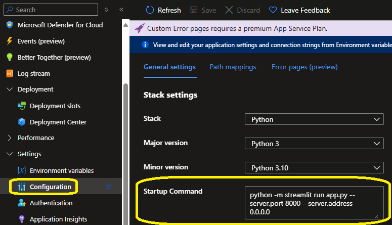
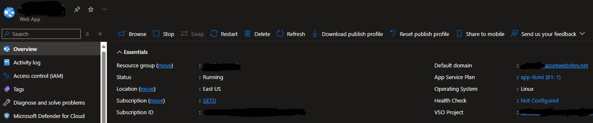

# Deploy aplicativo web com Streamlit no Azure App Service (Web APP) com Azure Devops.

Criei este repositório com o objetivo de facilitar o deploy de aplicativos web, feitos com Streamlit, no Azure App Service.

Faço isso com o intuito de ajudar a comunidade DEV brasileira, pois, quando precisei realizar essa tarefa para minha equipe de trabalho, encontrei várias dificuldades. Havia documentações em outros serviços de repositórios, documentações incompletas e dúvidas sem respostas.

Se eu conseguir ajudar uma pessoa, já terá valido a pena.

| :sparkles: Nome        | **Deploy Azure App Service**
| -------------  | --- |
| :label: Tecnologias | Python, Streamlit (tecnologias utilizadas)

Após ter o código pronto no arquivo app.py, listar as bibliotecas no arquivo requirements.txt, seguir o passo a passo abaixo.

## Comandos para rodar no terminal
### Logar no Azure:
```az login```

### Criar app service:
```az appservice plan create --name app-ilumi --resource-group rg-lab-fullstack --sku B1 --is-linux```

OBS: Neste app service plan, eu escolhi o B1, o mais básico. Você pode visualizar os tipos e preços [aqui](https://azure.microsoft.com/en-us/pricing/details/app-service/windows/?ef_id=_k_CjwKCAjw5Ky1BhAgEiwA5jGujpu-2SeR1qwB0FtSsWQES_G6kId6gMsbjCc_GQPibUao_7hXjj8HPBoCLXcQAvD_BwE_k_&OCID=AIDcmmzmnb0182_SEM__k_CjwKCAjw5Ky1BhAgEiwA5jGujpu-2SeR1qwB0FtSsWQES_G6kId6gMsbjCc_GQPibUao_7hXjj8HPBoCLXcQAvD_BwE_k_&gad_source=1&gclid=CjwKCAjw5Ky1BhAgEiwA5jGujpu-2SeR1qwB0FtSsWQES_G6kId6gMsbjCc_GQPibUao_7hXjj8HPBoCLXcQAvD_BwE)!

### Criar web app:
```az webapp create --name app-ilumi --resource-group rg-lab-fullstack --plan app-ilumi --runtime "python|3.10"```

## Adicionar em Settings > Configuration > General settings no campo Startup Command:
```python -m streamlit run app.py --server.port 8000 --server.address 0.0.0.0```



OBS: Caso ainda não tenha, criar o arquivo ```Procfile``` com o conteúdo: ```web: streamlit run sqlite.py --server.port 8080```

## Criar o pipeline no repositório
Com o arquivo azure-pipelines.yml, criar o pipeline no repositório do Azure Devops.


Para criar o pipeline, seguir a [documentação](https://learn.microsoft.com/pt-br/azure/devops/pipelines/create-first-pipeline?view=azure-devops&tabs=python%2Cbrowser).

O código do pipeline deve ser assim:

```ruby 
trigger:
- main
pr:
- main

variables:
  # Web app name
  webAppName: '<nome do aplicativo>'

  # Agent VM image name
  vmImageName: 'ubuntu-latest'

  # Environment name
  environmentName: '<nome do ambiente>`'

  # Project root folder. Point to the folder containing manage.py file.
  projectRoot: $(System.DefaultWorkingDirectory)

  # Python version: 3.10
  pythonVersion: '3.10'

stages:
- stage: Build
  displayName: Build stage
  jobs:
  - job: BuildJob
    pool:
      vmImage: $(vmImageName)
    steps:
    - task: UsePythonVersion@0
      inputs:
        versionSpec: '$(pythonVersion)'
      displayName: 'Use Python $(pythonVersion)'

    - script: |
        python -m venv antenv
        source antenv/bin/activate
        python -m pip install --upgrade pip
        pip install setup
        pip install -r requirements.txt
      workingDirectory: $(projectRoot)
      displayName: "Install requirements"
    - task: ArchiveFiles@2
      displayName: 'Archive files'
      inputs:
        rootFolderOrFile: '$(projectRoot)'
        includeRootFolder: false
        archiveType: zip
        archiveFile: $(Build.ArtifactStagingDirectory)/$(Build.BuildId).zip
        replaceExistingArchive: true

    - upload: $(Build.ArtifactStagingDirectory)/$(Build.BuildId).zip
      displayName: 'Upload package'
      artifact: drop

- stage: Deploy
  displayName: 'Deploy Web App'
  dependsOn: Build
  condition: succeeded()
  jobs:
  - deployment: DeploymentJob
    pool:
      vmImage: $(vmImageName)
    environment: $(environmentName)
    strategy:
      runOnce:
        deploy:
          steps:

          - task: UsePythonVersion@0
            inputs:
              versionSpec: '$(pythonVersion)'
            displayName: 'Use Python version'

          - task: AzureWebApp@1
            displayName: 'Deploy Azure Web App'
            inputs:
              azureSubscription: '<subscription do azure>'
              appType: 'webAppLinux'
              appName: '$(webAppName)'
              package: '$(Pipeline.Workspace)/drop/$(Build.BuildId).zip'
```

Após criar o pipe e rodá-lo, você realizará o deploy e poderá acessar através do link que você pode encontrar na página do app service no Azure. Ele está no campo "Default domain".



Caso tenham alguma correção ou comentário, não exitem em criar issues. 

Abraços!
